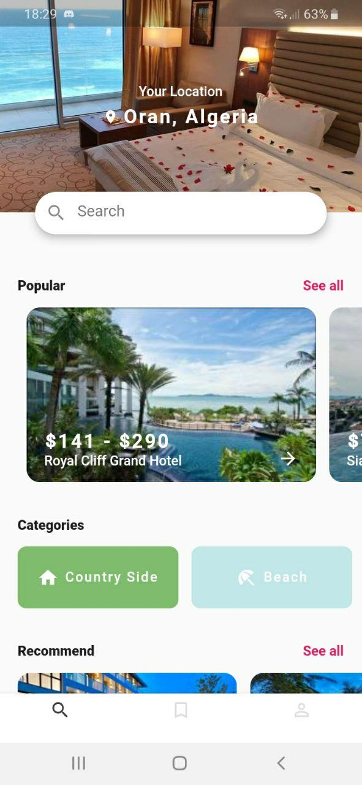
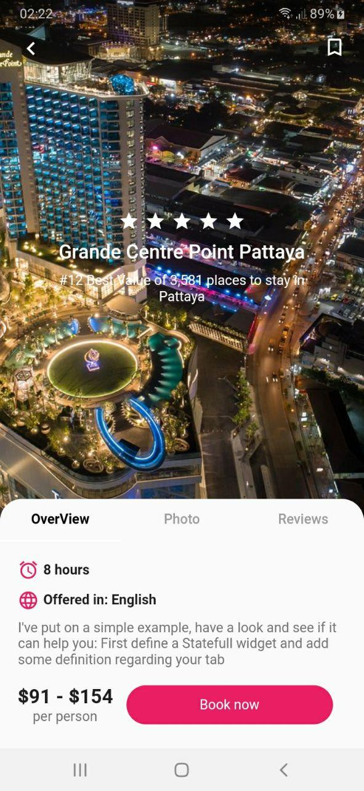

# Jet-Hotels

## Description:

This is the first app of my challenge (One week challenge), It's a Flutter Application that use a hotel [API](https://tripadvisor1.p.rapidapi.com/hotels/list?location_id=293919&adults=1&checkin=2020-10-15&rooms=1&nights=2) to display hotels and their information.

## ScreenShots:

 

## Tools & languages:
* Android studio (IDE)
* Dart (logic)
* Flutter (Mobile UI developement kit)

## Contribution:
Feel free to fork this project and add whatever you like. If you have any suggestions or any comments please feel free to contact me or to open an issue.

## Team:
[Jetlighters](https://github.com/JetLightStudio) having fun.

## Documentation
* [Install Flutter](https://flutter.dev/get-started/)
* [Flutter documentation](https://flutter.dev/docs)

For announcements about new releases and breaking changes, follow the
[flutter-announce@googlegroups.com](https://groups.google.com/forum/#!forum/flutter-announce)
mailing list.

